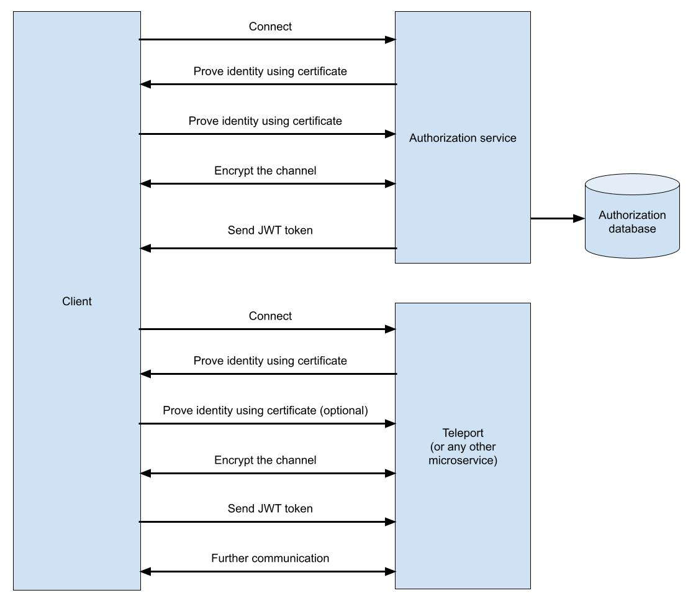
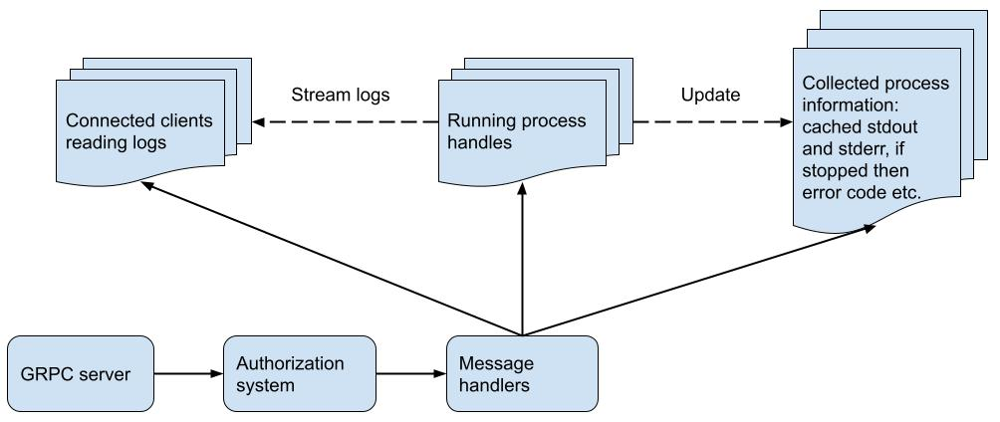

# Protocol design

## Protocol format

While JSON remains the most popular format for exchanging messages in the modern Internet, it is not without issues. 
It is relatively slow, requires manual forward and backward compatibility management,
requires manual writing of parsers and encoders in all languages that need to use it and requires maintenance of documentation.
Those problems can be solved by introducing a binary protocol with a schema that generates code for parsing and encoding messages.

The most popular binary message format at the moment is Google [Protobuf](https://developers.google.com/protocol-buffers). 
It is commonly used together with the [gRPC](https://grpc.io/) protocol and is an efficient replacement for REST API.

## Communication design

There are five operations that the client may perform:

- Start a job.
- Stop the job.
- Check the job status.
- Stream logs of the job (stderr and stdout).
- List pending jobs.

Those five operations can be directly mapped to five API methods:

- **Start** - starts the job. Returns one of:
  - Started task information (for example job ID that is necessary for other API calls)
  - Error in case the could could not be started.
- **Stop** - stops the given job. Returns finished process information.
- **GetStatus** - obtains information about the given job. Returns one of:
  - Finished process information
  - Running process information.
- **Logs** - stream of strings representing pieces of stdout or stderr. Once the client connects it first receives cached output of the given job, then a live stream generated by the process. This means that the output of the given task will be stored in the server in RAM.
- **List** - lists all pending tasks.

The precise message and API specification can be found [here](../proto/teleport.proto).

# Authentication And Authorization

Since this is a toy project, the default working mode is unencrypted and unauthenticated to allow easy exploration of the project.
Safe mode is optional and requires providing extra certificates. In real production solutions it's usually the opposite - safety is provided by default.

To enable safety it is required to:
1. Encrypt the connection using TLS.
2. Authenticate the user.
3. Authorize the given operation that user wants to perform.

Other safety features such as hardening dockers are out of scope for this project.

Production-ready solution would normally consist of an authorization service that upon authentication would issue signed documents with user privileges valid for some period of time,
that in turn would be sent by the user and used by the server to limit the scope of allowed operations.
The communication looks roughtly like this:

1. Client connects to the authorization service.
2. Bidirectional encryption is established using TLS. Domain of the server is verified using certificate.
3. Client prooves his identity using a certificate or password.
5. Authorization service check in the database what permissions are assigned to the client.
6. Authorization servcie generates a secret signed token and sends it to the client through the encrypted channel (the key is secret)
  Token is usually a document (i.e. JSON) that describes assigned privileges. 
  By signing it becomes a proof that the authorization service allows access to specific resources for some period of time to the owner of this token.
7. Having the token client can perform requests to all services until the certificate expires.
8. Client connects to the given microservice, in our case to the teleport server. Server Identity is again verified using TLS. Channels becomes encrypted.
9. Client certificate is optional - depending on the implementation client identity can be encoded in the token.
11. Client sends its token together with some request.
12. Server check if the token is correctly signed and uses its information for authorization.

This solution is however too complicated for this project as it requires use of an external authorization service which could be a project of its own.
gRPC has a bult-in support for OAuth 2.0 which combined with TLS will give us everything that is actually required. 
For simplicity, the user is going to be authenticated using a basic password comparison and after authentication every operation is going to be allowed.

# Application design

## Client

Client is a simple command line application with five subcommands. On receiving responses the client prints logs on the screen or prints relevant information on the screen.

## Server

Server is an asynchronous application with a gRPC server, authorization system, several message handlers and three collections:

- Running processes
- Information about finished processes
- Connected clients reading logs

In production the information about finished processes would be kept only for a period of time to avoid reaching resource limits and possibly would be saved to an external file/database to save RAM, but in this simple challenge only internal RAM-based collection are used.

# Resource limits

There are three kinds of limits that the server should impose on tasks:

- CPU
- Memory
- Disk

## CPU

Tthere are at least three ways how CPU usage can be limited:

- Total maximal CPU runtime can be configured using the setrlimit() Linux function (https://linux.die.net/man/2/setrlimit) or alternatively setrlimit64() for higher ranges. This approach limits total CPU runtime but not includes the time when the process is running but doing nothing, for example the `sleep` command.
- Limiting CPU cores available to the process by using the sched_setaffinity() function (https://man7.org/linux/man-pages/man2/sched_setaffinity.2.html).
- cgroups (https://man7.org/linux/man-pages/man7/cgroups.7.html) can be used to flexibly limit maximum CPU usage at the given moment.

Because limiting resources is not the key feature of this application, the first option (setrlimit()) is used.

## Memory

Memory - memory can be easily limited using the setrlimit() function.

## Disk

Linux qute surprisingly does not provide any good disk management mechanisms. There are three possiblities:

- Throotling can be implemented using cgroups.
- Process quotas are not supported but can be emulated using user quotas. In this approach a new user needs to be created for every task.
- Limiting single output file size can be easily achieved using setrlimit() function. This still not stop the application from creating millions of small files.

Because the first two solutions are quite complicated, the third is implemented.

# Tests

The project uses two kinds of tests:

- Unit tests - written in the Rust language.
- API tests of the server. While the server is written in a high performance language and uses asynchronous dispatching to optimize resource usage, there is no need for this in tests. To shorten development and make tests more managable, the tests are written in the Python 3 language.

# Build system

Rust already has a default build system called cargo. However, to make the builds fully reproducible a complete environment is needed and a Dockerfile needs to be created. It consists of three stages:

1. Rust container designed to have a reproducible client and server builds together with unit tests.
2. Python 3 container designed to perform the API tests.
3. Final container designed to be small but able to run client and server applications.

# Libraries and tools

Rust crates:

- `tonic` - the only production-ready GRPC Rust crate
  tokio - asynchronous event dispatcher
- `tokio::process` - asynchronous process management
- `clap` - command line argument parser for the client
- `jsonwebtoken` - for creation and validation of JWT tokens
- `serde` - JSON and configuration deserialization

Tests:

- `Python 3`
- `pytest` - the most popular Python 3 test executor
- `grpc` python package - GRPC functionality
- `stress` application - for resource limit tests, it is designed to simulate high resource usage

Other

- Build system: `cargo`, `Docker`
